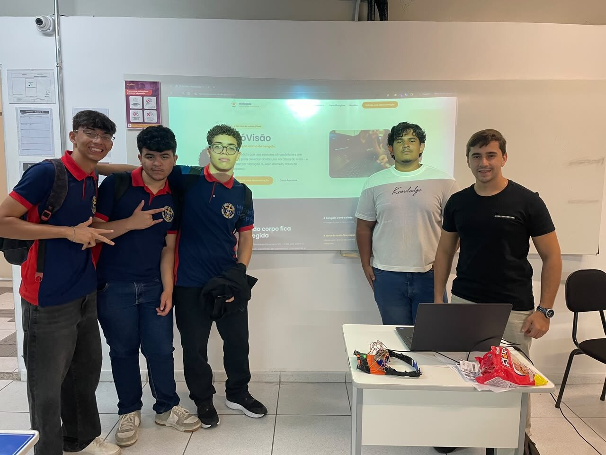
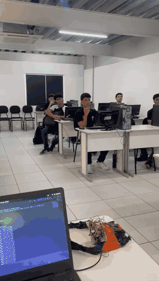
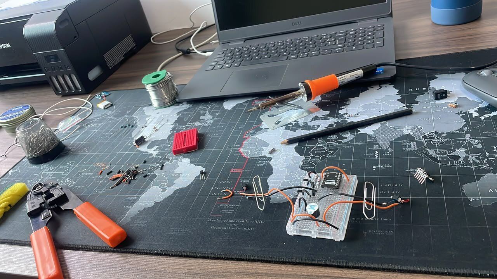
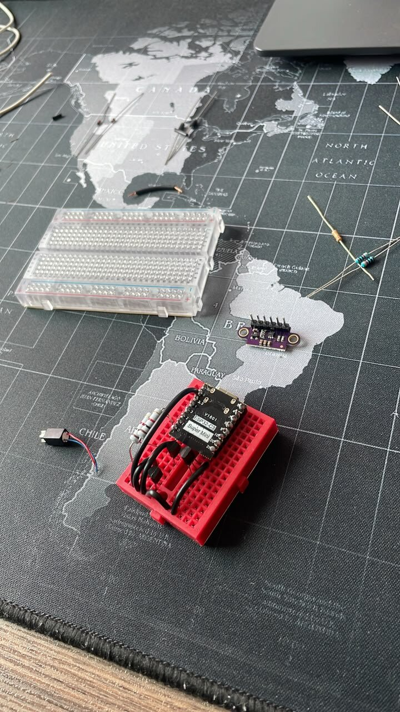
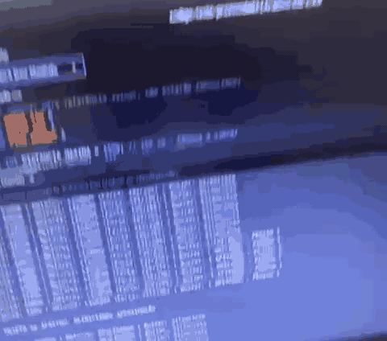
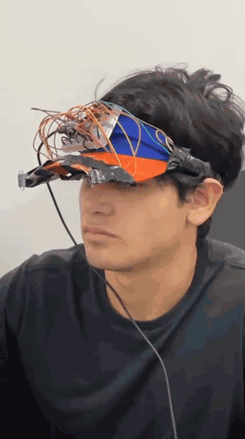

# Histórico do projeto

Aqui contamos a linha do tempo da PróVisão, do primeiro diagnóstico até hoje. As entradas mais recentes ficam no topo. Sempre que um marco tiver foto ou vídeo, colocamos o link junto: toda evidência faz parte da história.

## [Em andamento] V1.5

### 27 de setembro de 2026: o boné tomou forma

- **Trocamos a viseira por um boné de aba curva.** Optamos pelo boné por ser um objeto do dia a dia. Os fios passam por uma canaleta costurada por fora, de ponta a ponta. Contamos o raciocínio na [decisão 002](documentacao/decisoes/002-bone-no-lugar-da-viseira.md).
- **Os motores saíram das têmporas e foram para perto da nuca.** Nas têmporas a vibração causava um desconforto forte.
- **Trocamos a bateria.** Saiu a bateria mole de 300 mAh e entrou uma 14500 com carcaça de aço, proteção interna e fusível rearmável. A autonomia estimada subiu de 3 para cerca de 8 horas ([decisão 003](documentacao/decisoes/003-bateria-14500.md)).
- **Desenhamos todas as peças 3D em código**, com as medidas num único arquivo: case da eletrônica, case da bateria, suportes dos sensores na aba (em três inclinações) e berços dos motores. Um programa confere os encaixes antes de qualquer impressão ([decisão 004](documentacao/decisoes/004-pecas-3d-e-fixacao-no-bone.md)).
- **Modelamos o boné inteiro montado**, com cases, sensores, motores e cabos, e geramos um arquivo 3D que abre no navegador.
- **Cuidamos do conforto.** Nenhuma peça dura encosta na pele: placas internas mais finas com almofada de EVA, berços dos motores em plástico flexível dentro de um bolsinho de tecido ([decisão 005](documentacao/decisoes/005-conforto-no-contato-com-a-cabeca.md)).
- **Preparamos o pedido de impressão 3D** em dois lotes (um para testar os encaixes e o kit completo) e a lista de compras com as metragens de fio.
- **Reorganizamos o repositório** com pastas em português e reescrevemos a documentação para ficar mais fácil de entender.
- **Organizamos o acervo de fotos e vídeos** dos principais momentos do projeto: reduzimos as fotos, transformamos os vídeos em GIFs curtos e colocamos cada registro na sua data nesta linha do tempo.
- **Revisamos as licenças.** Percebemos que as licenças escolhidas em julho deixavam qualquer pessoa copiar e vender o projeto. Optamos por licenças abertas e recíprocas (GPL 3.0 no programa, CERN-OHL-S 2.0 na eletrônica e nas peças, CC BY-NC-SA 4.0 na documentação), separamos um arquivo de licença por área e decidimos registrar as marcas no INPI ([decisão 006](documentacao/decisoes/006-licencas.md)).

### 17 de setembro de 2026: a PróVisão na feira de profissões

- A coordenação dos cursos de Ciência da Computação e de Análise e Desenvolvimento de Sistemas da UniFavip Wyden nos convidou para expor a PróVisão na feira de profissões da faculdade, com uma palestra sobre a trajetória do projeto.
- Na palestra, contamos o caminho desde o começo: o problema dos obstáculos altos que a bengala não alcança, a parceria com a ACACE, o protótipo V1 na viseira e a construção do boné da V1.5.
- Levamos a viseira da V1 para a mesa, porque o boné da V1.5 ainda está em construção, e projetamos o site da Horizonte enquanto falávamos. Depois da palestra, estudantes visitantes vieram ver o protótipo de perto.

  
  
  

*A palestra no laboratório, a equipe com estudantes visitantes em frente à projeção do site e um passeio rápido pela sala. Outras fotos da palestra estão em [`fotos-e-videos/`](fotos-e-videos/).*

### Início da V1.5

- Começamos a construção da V1.5: sair da placa de testes para uma placa soldada e peças impressas em 3D, seguindo o plano de ação e o guia de construção do grupo.
- Definimos as correções de segurança elétrica: ajuste da corrente de carga, capacitores para a placa não reiniciar quando os motores ligam, limite de força nos motores e alerta sonoro quando um sensor falha.
- Publicamos o programa da V1.5 em `firmware/src/`, com níveis de vibração bem separados e recuperação de falha. A V1 original continua guardada em `firmware/legado/`.

<!-- [MÍDIA] adicionar fotos da bancada de construção da V1.5 conforme o trabalho avançar -->

## 11 de julho de 2026: decisões de produto

- O projeto ganhou nome: **PróVisão**, primeiro produto da Horizonte Inovação Assistiva.
- Definimos as licenças: MIT para o programa, CERN-OHL-P 2.0 para a eletrônica e as peças, CC BY-SA 4.0 para a documentação.
- Consolidamos a identidade visual do manual de marca: Petróleo `#1B6C79`, Coral `#E07A5F`, Âmbar Sol `#EBA84C` e a fonte Poppins.
- Decidimos que a validação acontece em percurso interno ou na sombra, respeitando o limite do sensor sob sol direto.

## Maio de 2026: validação e encerramento da disciplina

- Apresentamos o projeto na disciplina de Programação de Microcontroladores (UniFavip Wyden) e **recebemos a nota máxima**.
- Entregamos o relatório final de extensão à coordenação.

  
  

*À esquerda, a apresentação do protótipo na avaliação da disciplina. À direita, a demonstração: a mão chega perto da cabeça como se fosse um obstáculo alto, para a viseira acusar a aproximação.*

<!-- [MÍDIA] adicionar registros da atividade com a ACACE neste período, se existirem (somente com autorização de imagem) -->

## Abril de 2026: protótipo físico

- Montamos o circuito na placa de testes e prendemos na aba da viseira. Integramos o programa na ESP32-C3 e calibramos distância e tempo de resposta.
- Fizemos o primeiro contato de alinhamento com a ACACE e formalizamos a parceria (Carta de Apresentação e Termo de Aceite, em 30/04/2026).
- Aprendemos uma lição importante: a fixação com fita e fios expostos serviu para demonstrar, mas não é segura nem confortável para um teste com usuários reais. Foi daí que nasceu a V1.5.

  
  
  

*A montagem do protótipo V1 na bancada: a placa ESP32-C3, os dois sensores a laser e a placa de testes.*

  
  

*À esquerda, o primeiro teste do programa na placa: o monitor serial mostra a distância de cada sensor e a reação dos motores e do bipe. À direita, o protótipo V1 já preso na viseira (registro feito na apresentação de maio).*

*Primeira reunião com a ACACE, com o presidente e a vice-presidente da associação.*

## Março de 2026: especificação e simulação

- Levantamos os requisitos e compramos os componentes, mantendo desde o começo a meta de baixo custo.
- Tomamos uma decisão importante: trocar o sensor ultrassônico HC-SR04 pelos sensores a laser VL53L0X. Ganhamos precisão de milímetros e uma leitura separada para cada lado. Registramos na [decisão 001](documentacao/decisoes/001-sensor-laser-no-lugar-do-ultrassom.md).
- Testamos a lógica num simulador (Wokwi e Tinkercad) antes de montar qualquer coisa.

*A primeira lógica rodando no simulador, ainda com os sensores ultrassônicos, antes da troca pelo laser. Também guardamos um [detalhe da simulação](fotos-e-videos/2026-03-simulacao-ultrassom-detalhe.gif) com a distância medida na tela.*

## Fevereiro de 2026: diagnóstico

- Formamos o grupo e definimos o problema: os "obstáculos altos" que a bengala branca não detecta.
- Escolhemos a ACACE (Associação Caruaruense de Cegos e Amblíopes) como parceira e público participante do projeto de extensão.
- Pesquisamos referências em tecnologia assistiva, sistemas embarcados e sensores.
