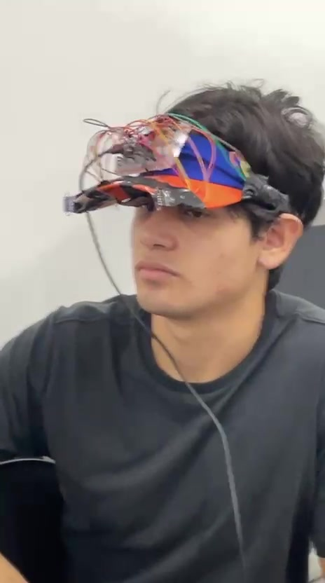
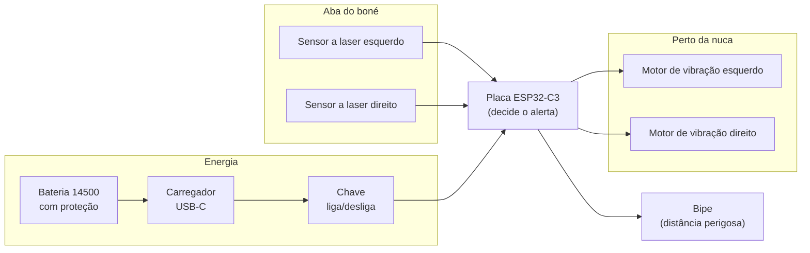
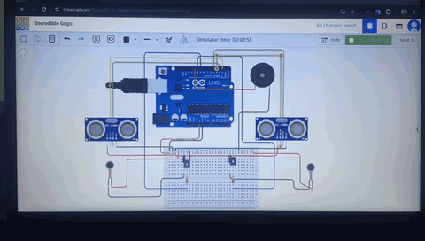
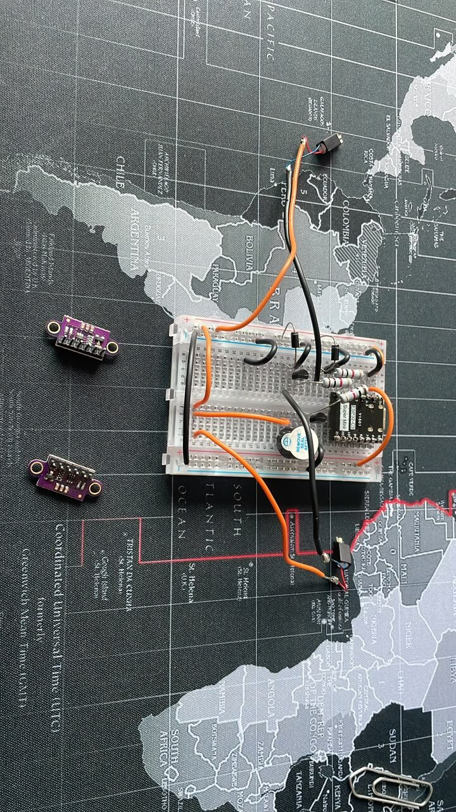
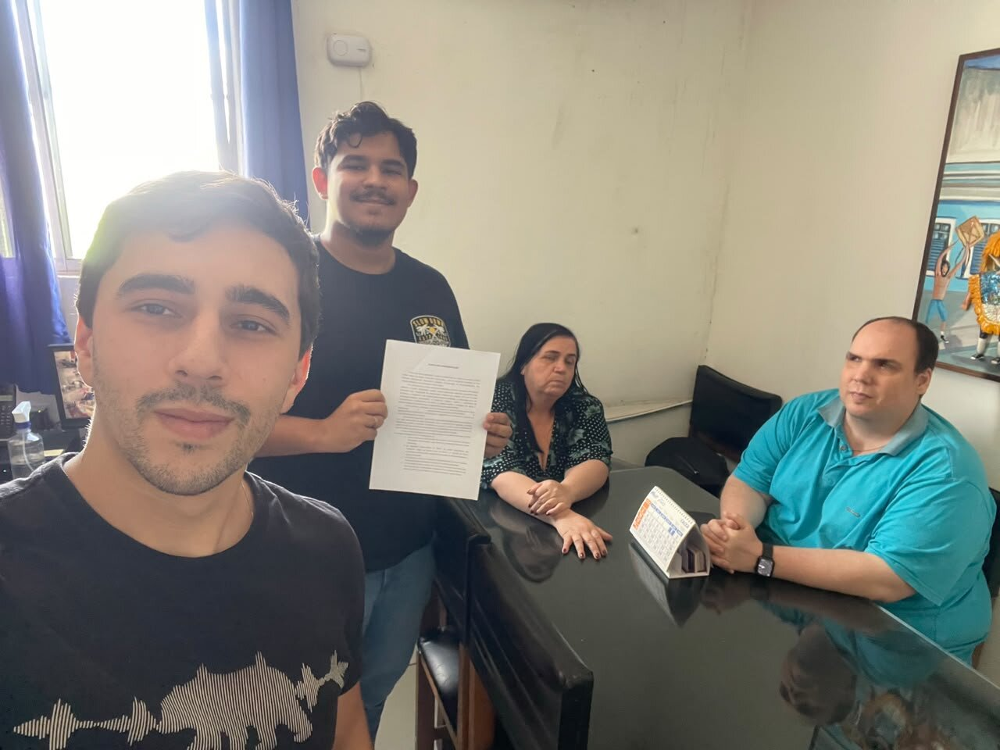
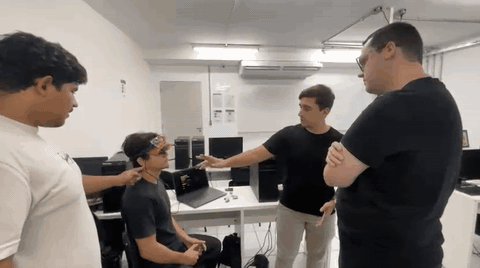
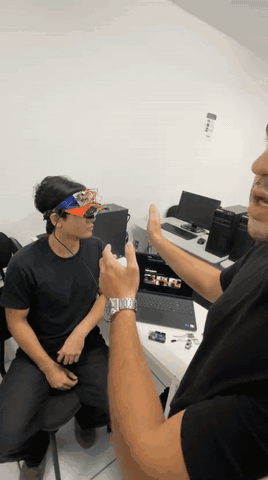
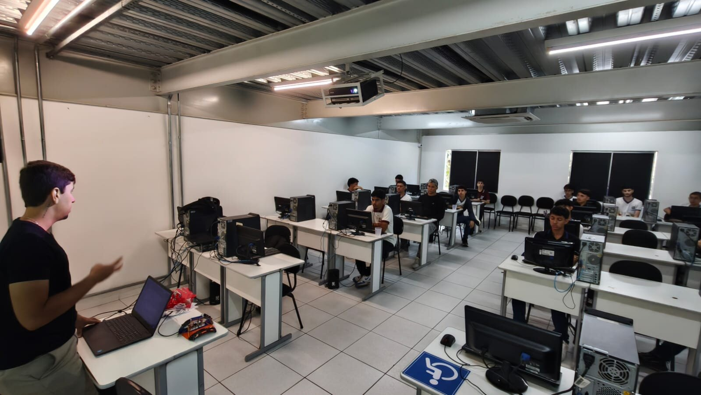

<p align="center">
  <!-- [MÍDIA] Substituir pelo logo oficial (versão horizontal, Petróleo + Coral) exportado do manual de marca -->
  <em>(espaço reservado para o logo da Horizonte Inovação Assistiva)</em>
</p>

# PróVisão

**Transformando o desafio em solução.** Um boné que avisa, por vibração, o que a bengala branca não alcança.


<p align="center">
  
  
  <br><em>À esquerda, o modelo 3D da versão 1.5, com tudo montado no boné. À direita, o protótipo V1 na viseira, em uso na apresentação da disciplina (maio de 2026). Quando o boné real ficar pronto, a foto dele entra no lugar do modelo 3D.</em>
</p>

## Por que criamos a PróVisão

A bengala branca é ótima para explorar o chão, mas não protege o que está na altura do peito e da cabeça: galhos de árvore, placas de sinalização, orelhões, lixeiras penduradas. Quem convive com deficiência visual conhece bem o risco dessas batidas.

A PróVisão é a nossa resposta. Colocamos dois sensores de distância a laser na aba de um boné comum. Quando um obstáculo alto se aproxima, o boné vibra perto da nuca, mais forte quanto mais perto ele está e do lado em que ele está. Se a distância fica perigosa, um bipe toca. Obstáculo à direita, vibração à direita: a pessoa ganha noção de direção, não só de perigo.

Na primeira versão usamos uma viseira. Trocamos pelo boné porque ele é um objeto do dia a dia: quem usa a PróVisão não precisa andar com algo que tenha cara de equipamento.

Os componentes eletrônicos custam cerca de R$ 150, enquanto soluções importadas parecidas chegam a custar dez vezes mais. Acreditamos que tecnologia assistiva precisa ser acessível também no preço.

> **Importante:** a PróVisão **complementa** a bengala branca, nunca substitui. É um protótipo experimental em fase de validação. Antes de qualquer uso, leia [documentacao/seguranca.md](documentacao/seguranca.md).

## Como funciona



Cada sensor mede a distância pelo tempo que um feixe de luz infravermelha leva para ir até o obstáculo e voltar. Ele alcança cerca de 2 metros em ambiente fechado, com precisão de milímetros. A placa transforma essa distância em três níveis de vibração e toca o bipe abaixo de 30 cm. Explicamos cada parte, com calma, em [documentacao/como-funciona.md](documentacao/como-funciona.md).

## O que tem neste repositório

| Pasta | O que você encontra |
|---|---|
| [`firmware/`](firmware/) | O programa que roda na placa ESP32-C3 |
| [`eletronica/`](eletronica/) | Esquema de ligações e lista de materiais |
| [`modelagem-3d/`](modelagem-3d/) | Peças impressas em 3D, o boné montado e o pedido de impressão |
| [`documentacao/`](documentacao/) | Como funciona, segurança, roteiro de testes e as decisões que tomamos |
| [`fotos-e-videos/`](fotos-e-videos/) | Registro do desenvolvimento e dos testes |
| [`HISTORICO.md`](HISTORICO.md) | A linha do tempo do projeto, do diagnóstico até hoje |

Mantivemos três nomes em inglês de propósito. `README.md`, `LICENSE` e `CONTRIBUTING.md` são nomes que o GitHub reconhece e exibe em destaque. E a pasta `firmware/` guarda as subpastas `src/` e `include/`, que a ferramenta de compilação (PlatformIO) exige com esses nomes.

## Onde estamos e para onde vamos

| Versão | O que é | Situação |
|---|---|---|
| V1 | Protótipo em placa de testes, preso numa viseira. Validado em sala (nota máxima na disciplina) e apresentado à ACACE | Concluída |
| **V1.5** | Boné com placa soldada, peças impressas em 3D, bateria mais segura e motores na nuca, pronto para o teste de campo com usuários | **Em construção** |
| V2 | Placa de circuito própria, bem menor, e programa preparado para registrar dados de uso | Planejada |
| V3 | Sensores que funcionem bem sob sol direto e envio de dados por Bluetooth | Futuro |

As discussões do dia a dia ficam nas [Issues](../../issues).

## Como gravar o programa na placa

```bash
git clone https://github.com/Horizonte-Inovacao/provisao.git
cd provisao/firmware
pio run                 # compila
pio run -t upload       # grava no ESP32-C3 pelo cabo USB-C
pio device monitor      # mostra as mensagens da placa no computador
```

Antes de gravar, desligue a chave do boné. O motivo está em [documentacao/seguranca.md](documentacao/seguranca.md).

Todos os ajustes (pinos, distâncias, força da vibração) ficam em [`firmware/include/config.h`](firmware/include/config.h). Dá para calibrar o boné sem mexer na lógica do programa.

## A eletrônica em resumo

Uma placa ESP32-C3 Super Mini, dois sensores de distância a laser VL53L0X, dois motores de vibração tipo moeda, um bipe, uma bateria 14500 de 3,7 V com proteção e um carregador USB-C. O esquema completo está em [`eletronica/esquema-eletrico.md`](eletronica/esquema-eletrico.md) e tudo o que precisa ser comprado está em [`eletronica/lista-de-materiais.csv`](eletronica/lista-de-materiais.csv).

## Registro em imagens

O acervo completo, com os arquivos já reduzidos, fica em [`fotos-e-videos/`](fotos-e-videos/). Os GIFs não têm som, por isso escolhemos trechos que se explicam só com a imagem.

| Momento | Mídia |
|---|---|
| Primeiro teste da lógica, no simulador (março de 2026) |  |
| Bancada: protótipo V1 na placa de testes (abril de 2026) |  |
| Primeira reunião com a ACACE (abril de 2026) |  |
| Apresentação em sala (maio de 2026, nota máxima) |  |
| O protótipo V1 em uso, com a mão no papel do obstáculo (maio de 2026) |  |
| Palestra na feira de profissões da faculdade (17 de setembro de 2026) |  |

## Como o projeto começou

A PróVisão nasceu em 2026.1 como projeto de extensão da disciplina de Programação de Microcontroladores do Centro Universitário UniFavip Wyden, em Caruaru-PE, com orientação do Prof. Rodrigo Frutuoso Lopes e em parceria com a **ACACE (Associação Caruaruense de Cegos e Amblíopes)**. Foi ouvindo os associados da ACACE que tomamos as decisões mais importantes do produto, como avisar o lado do obstáculo pela vibração. Hoje mantemos o projeto como o primeiro produto da **Horizonte Inovação Assistiva**.

## Equipe

| | |
|---|---|
| **Edson Gabriel Soares da Fonseca** | Programa da placa e liderança técnica |
| **Nadson Alex da Silva** | Eletrônica e protótipo físico |
| **João Luiz Pereira Filho** | Relação com as instituições, qualidade e testes de campo |

## Licenças

O programa da placa está sob [MIT](LICENSE). A eletrônica e as peças 3D estão sob [CERN-OHL-P 2.0](eletronica/LICENCA-HARDWARE.md). A documentação está sob [CC BY-SA 4.0](https://creativecommons.org/licenses/by-sa/4.0/deed.pt-br). As três permitem usar, estudar e adaptar o projeto, desde que o crédito seja mantido.

---

<p align="center"><sub>Horizonte Inovação Assistiva · clara, confiável e humana · Caruaru-PE</sub></p>
