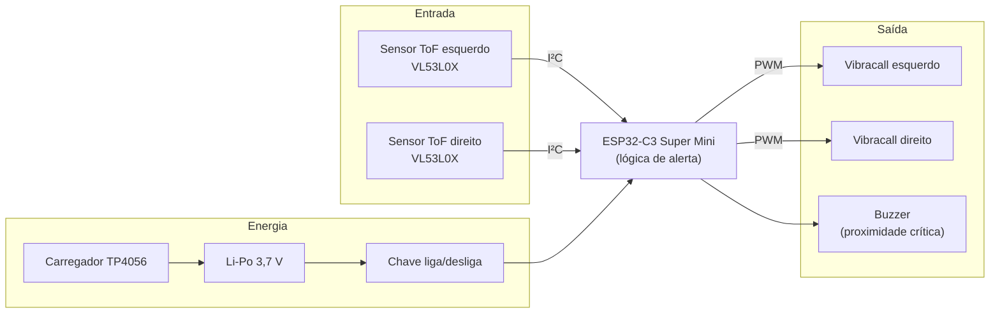

<p align="center">
  <!-- [MÍDIA] Substituir pelo logo oficial (versão horizontal, Petróleo + Coral) exportado do manual de marca -->
  <em>(espaço reservado para o logo da Horizonte Inovação Assistiva)</em>
</p>

# PróVisão

**Transformando o desafio em solução** — uma viseira que avisa, por vibração, o que a bengala branca não alcança.


<p align="center">
  <!-- [MÍDIA] Foto ou GIF principal: o protótipo em uso durante a apresentação em sala.
       Salvar em docs/assets/prototipo-em-uso.jpg e descomentar a linha abaixo. -->
  <!--  -->
  <em>(espaço reservado para a foto principal do protótipo em uso)</em>
</p>

## Por que criamos a PróVisão

A bengala branca é uma ferramenta excelente para rastrear o chão, mas não protege o que está na altura do tronco e da cabeça: galhos de árvore, placas de sinalização, orelhões, lixeiras suspensas. Quem convive com deficiência visual conhece bem o risco dessas colisões.

A PróVisão é a nossa resposta: uma viseira comum com dois sensores de distância a laser na aba. Quando um obstáculo aéreo se aproxima, a viseira vibra  mais forte quanto mais perto, e do lado onde o obstáculo está. Se a proximidade fica crítica, um alerta sonoro dispara. Obstáculo à direita, vibração à direita: o usuário ganha noção de direção, não só de perigo.

Tudo isso com componentes que custam cerca de R$ 150, enquanto soluções importadas equivalentes chegam a custar dez vezes mais. Acreditamos que tecnologia assistiva precisa ser acessível também no preço.

> **Importante:** a PróVisão é um **complemento** à bengala branca, nunca um substituto. É um protótipo experimental em validação, para mais informações, leia [docs/seguranca.md](docs/seguranca.md) antes de qualquer uso.

## Como funciona



Os sensores medem a distância por tempo de voo da luz infravermelha (até ~2 m em ambiente interno, com resolução de milímetros). O firmware converte a distância em três níveis de vibração e aciona o buzzer abaixo de 30 cm.

## O que tem neste repositório

| Pasta | Conteúdo |
|---|---|
| [`firmware/`](firmware/) | Código do ESP32-C3 |
| [`hardware/`](hardware/) | Esquema elétrico e lista de materiais com custos |
| [`enclosure/`](enclosure/) | Modelos 3D do case (CAD fonte + STL para impressão) |
| [`docs/`](docs/) | Arquitetura, decisões de engenharia , protocolo de testes e segurança |
| [`media/`](media/) | Fotos e vídeos do desenvolvimento e dos testes |

## Estado atual e roadmap

| Versão | O que é | Status |
|---|---|---|
| V1 | Protótipo em protoboard, validado em sala de aula (nota máxima na disciplina) e apresentado à ACACE | Concluída |
| **V1.5** | Placa soldada + case impresso em 3D + correções de segurança elétrica, para o teste de campo com usuários reais | **Em construção** |
| V2 | PCB dedicada (KiCad) + firmware refatorado com suporte a telemetria | Planejada |
| V3 | Sensoriamento para ambientes externos (sol direto) + telemetria via BLE | Futuro |

O roadmap detalhado e as discussões ficam nas [Issues](../../issues).

## Como compilar e gravar

```bash
git clone https://github.com/Horizonte-Inovacao/provisao.git
cd provisao/firmware
pio run                 # compila
pio run -t upload       # grava no ESP32-C3 via USB-C
pio device monitor      # abre o monitor serial (115200)
```

Os pinos, limiares de distância e níveis de vibração ficam todos em [`firmware/include/config.h`](firmware/include/config.h) — dá para ajustar sem tocar na lógica.

## Hardware em resumo

ESP32-C3 Super Mini · 2× VL53L0X (I²C, endereços 0x30/0x29 via XSHUT) · 2× micro motores vibracall · buzzer ativo · Li-Po 3,7 V 300 mAh com carregador TP4056 (corrente de carga ajustada para a célula). Esquema completo em [`hardware/esquematico/`](hardware/esquematico/) e lista de materiais com custos em [`hardware/bom/BOM.csv`](hardware/bom/BOM.csv).

## Registro em imagens

<!-- [MÍDIA] Preencher a tabela abaixo conforme as mídias forem organizadas em media/ e docs/assets/ -->

| Momento | Mídia |
|---|---|
| Apresentação em sala (2026.1) | *(espaço reservado — foto da banca/apresentação)* |
| Colegas operando o dispositivo | *(espaço reservado — vídeo ou GIF)* |
| Bancada: protótipo V1 na protoboard | *(espaço reservado — foto)* |
| Visita à ACACE | *(espaço reservado — foto, mediante autorização de imagem)* |

## Origem do projeto

A PróVisão nasceu em 2026.1 como projeto de extensão da disciplina de Programação de Microcontroladores (Centro Universitário UniFavip Wyden, Caruaru-PE), orientada pelo Prof. Rodrigo Frutuoso Lopes, em parceria com a **ACACE — Associação Caruaruense de Cegos e Amblíopes**. A escuta dos associados da ACACE definiu decisões centrais do produto, como a preferência pela vibração direcional. Hoje o projeto é mantido pelo grupo como o primeiro produto da **Horizonte Inovação Assistiva**.

## Equipe

| | |
|---|---|
| **Edson Gabriel Soares da Fonseca** | Arquitetura de software embarcado e Tech Lead |
| **Nadson Alex da Silva** | Hardware e prototipagem física |
| **João Luiz Pereira Filho** | Articulação institucional, QA e validação de campo |

## Licenças

Firmware sob [MIT](LICENSE) · Hardware sob [CERN-OHL-P 2.0](hardware/LICENSE.md) · Documentação sob [CC BY-SA 4.0](https://creativecommons.org/licenses/by-sa/4.0/deed.pt-br).

---

<p align="center"><sub>Horizonte Inovação Assistiva · clara, confiável e humana · Caruaru-PE</sub></p>
