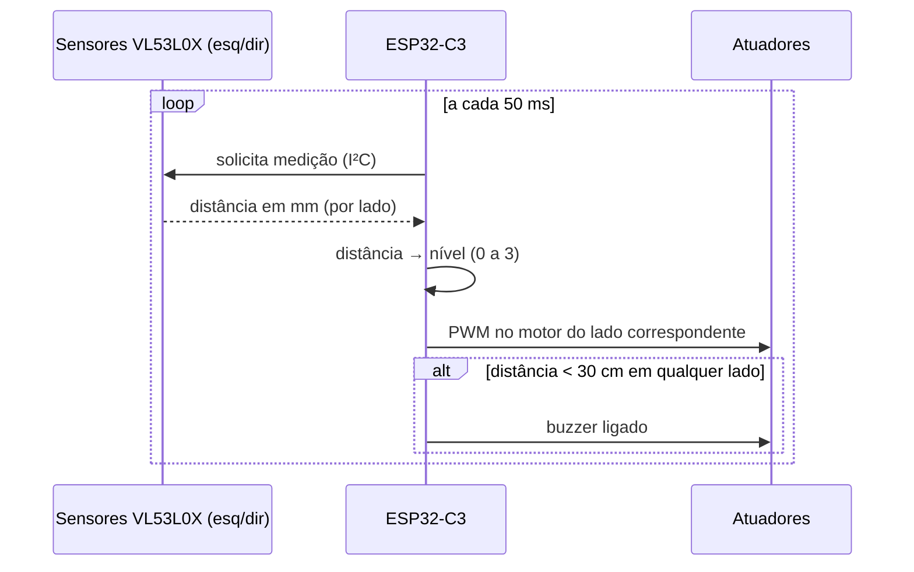

# Arquitetura — PróVisão

Como o dispositivo funciona por dentro, da luz infravermelha até a vibração na têmpora do usuário.

## Visão geral

O sistema opera em ciclo contínuo de ~50 ms: mede a distância dos dois lados, converte em nível de alerta e atua nos motores e no buzzer. Não há conectividade ativa na V1.5, Wi-Fi/BLE ficam para a telemetria da V2.

## Decisões que definem o produto

**Lateralização.** Sensor esquerdo comanda o motor esquerdo; direito comanda o direito. O usuário não recebe só "tem algo perto" — recebe *de que lado*. Essa foi a regra de negócio nº 1 desde a escuta inicial com a ACACE.

**Níveis discretos, não rampa.** A V1 usava intensidade proporcional contínua; na prática, valores baixos de PWM nem giravam o motor e a variação fina não era perceptível. A V1.5 usa três níveis bem separados (fraco/médio/forte) com um pulso de partida (kick-start), mais fácil de sentir e de aprender.

**Falha audível.** Se um sensor não responde, o dispositivo emite bipes de erro e tenta se recuperar. Um dispositivo assistivo que falha em silêncio é pior do que nenhum, porque cria confiança falsa.

## Limiares (calibráveis em `firmware/include/config.h`)

| Distância | Comportamento |
|---|---|
| > 150 cm | silêncio |
| 100–150 cm | vibração fraca (nível 1) |
| 50–100 cm | vibração média (nível 2) |
| < 50 cm | vibração forte (nível 3) |
| < 30 cm | buzzer (qualquer lado) |

## Limites conhecidos (honestidade técnica)

- O VL53L0X é um sensor infravermelho: **sob sol direto o alcance cai de ~2 m para ~60–80 cm**. Por isso a validação da V2 acontece em percurso interno/sombreado; ambiente externo é meta da V3 com sensoriamento complementar.
- O campo de visão de cada sensor é de ~25°; o apontamento dos dois define a cobertura à frente. O mapa de cobertura será validado no protocolo de testes.
- Autonomia estimada com a célula de 300 mAh: 3–4 h contínuas, suficiente para sessões de teste; será medida de verdade nos KPIs.

## Energia

Bateria Li-Po 3,7 V → chave geral → trilho VBAT (motores/buzzer) e regulador 3,3 V do ESP32 (lógica + sensores). Carga via TP4056 com proteção, corrente ajustada para ~250 mA (célula de 300 mAh). Regra de uso: **nunca carregar com o dispositivo na cabeça**.

<!-- [MÍDIA] adicionar aqui o diagrama de blocos desenhado pelo grupo e a foto do layout da placa V1.5 quando pronta -->
