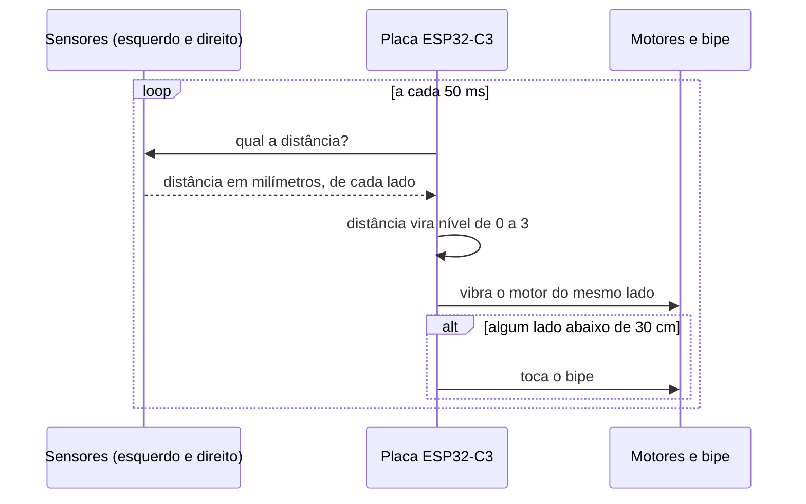

# Como a PróVisão funciona

Aqui explicamos o caminho completo: da luz que sai do sensor até a vibração que a pessoa sente na nuca. Tentamos escrever para quem nunca mexeu com eletrônica conseguir acompanhar.

## O ciclo de 50 milissegundos

A placa repete o mesmo ciclo 20 vezes por segundo:

1. pergunta a distância para os dois sensores, o da esquerda e o da direita;
2. converte cada distância em um nível de alerta, de 0 (nada) a 3 (forte);
3. liga o motor do lado correspondente na força daquele nível;
4. se qualquer lado estiver abaixo de 30 cm, toca o bipe.

Nesta versão a placa não usa Wi-Fi nem Bluetooth. Deixamos a conexão sem fio para a V2, quando o boné vai registrar dados de uso.

## As peças e o que cada uma faz

**Sensores de distância (VL53L0X).** Cada sensor manda um feixe de luz infravermelha, invisível e seguro para os olhos, e mede quanto tempo ela leva para bater no obstáculo e voltar. É o que chamamos de medição por "tempo de voo". Os dois sensores conversam com a placa pelos mesmos dois fios de dados (a chamada comunicação I²C). Para a placa saber quem é quem, ela dá um endereço diferente para cada sensor toda vez que liga.

**Placa ESP32-C3 Super Mini.** É o cérebro. Ela recebe as distâncias, decide o alerta e comanda motores e bipe. Cabe na ponta de um dedo e custa pouco.

**Motores de vibração.** São iguais aos que fazem um celular vibrar, no formato de uma moeda pequena. A placa controla a força ligando e desligando o motor muito rápido. Quanto mais tempo ligado em cada pulso, mais forte a vibração. Esse controle por pulsos tem o nome técnico de PWM.

**Bipe.** Um pequeno buzzer que toca quando a distância fica perigosa e também avisa quando algo dá errado.

**Bateria e carregador.** Uma bateria de lítio no formato 14500 (do tamanho de uma pilha AA) com proteção interna, carregada por um módulo com entrada USB-C. Contamos por que escolhemos essa bateria em [decisoes/003-bateria-14500.md](decisoes/003-bateria-14500.md).

## Decisões que definem o produto

**Lado do obstáculo = lado da vibração.** O sensor esquerdo comanda o motor esquerdo, e o direito comanda o direito. A pessoa não recebe só um "tem algo perto", recebe "tem algo perto, à esquerda". Essa foi a regra número 1 desde as primeiras conversas com a ACACE.

**Três níveis bem separados em vez de uma rampa.** Na V1 a vibração aumentava aos poucos, conforme a distância diminuía. Na prática, as vibrações mais fracas nem faziam o motor girar, e a pessoa não percebia a diferença entre um nível e outro. Por isso passamos a usar três níveis bem distintos (fraco, médio e forte), com um empurrão curto no início de cada vibração para o motor sair do lugar. Fica mais fácil de sentir e de aprender.

**Motores perto da nuca.** No começo os motores ficavam nas têmporas, mas ali a vibração incomodava bastante. Levamos os dois para a região da nuca, um de cada lado, dentro da faixa interna do boné. O lado continua sendo percebido com clareza. Detalhes em [decisoes/002-bone-no-lugar-da-viseira.md](decisoes/002-bone-no-lugar-da-viseira.md).

**Falha que se escuta.** Se um sensor para de responder, o boné toca bipes de erro e tenta se recuperar sozinho. Concluímos que um equipamento assistivo que falha em silêncio é pior do que não ter equipamento nenhum, porque a pessoa confia num alerta que não vai chegar.

## Distâncias e alertas

Todos esses valores podem ser ajustados em [`firmware/include/config.h`](../firmware/include/config.h).

| Distância até o obstáculo | O que acontece |
|---|---|
| mais de 150 cm | nada |
| de 100 a 150 cm | vibração fraca (nível 1) |
| de 50 a 100 cm | vibração média (nível 2) |
| menos de 50 cm | vibração forte (nível 3) |
| menos de 30 cm | bipe, de qualquer lado |

## Limites que conhecemos

Preferimos deixar claro o que o boné ainda não faz bem:

- **Sol direto.** O sensor trabalha com luz infravermelha, e o sol tem muita luz infravermelha. Debaixo de sol forte o alcance cai de uns 2 m para algo entre 60 e 80 cm. Por isso os testes de campo acontecem em ambiente interno ou na sombra. Resolver o uso ao ar livre é meta da V3.
- **Área coberta.** Cada sensor enxerga um cone de uns 25 graus. A inclinação dos suportes na aba define o que fica coberto à frente, e vamos medir essa cobertura no roteiro de testes.
- **Autonomia.** Estimamos cerca de 8 horas de uso contínuo com a bateria 14500. Esse número ainda é uma conta no papel e vamos medir de verdade nos testes.

## Energia

A bateria fica num case do lado direito do boné e o cabo dela contorna a nuca até o case da eletrônica, do lado esquerdo. Lá, o carregador USB-C cuida da carga e da proteção, e a chave liga/desliga corta a energia do resto do circuito. O carregador foi ajustado para carregar a cerca de 400 mA, que é o recomendado para essa bateria.

A regra mais importante: **nunca carregar com o boné na cabeça.** As outras regras estão em [seguranca.md](seguranca.md).

<!-- [MÍDIA] adicionar aqui o diagrama de blocos desenhado pelo grupo e a foto da placa soldada da V1.5 quando estiver pronta -->
