# Modelagem 3D

Aqui estão todas as peças impressas em 3D da PróVisão V1.5 e o boné montado com tudo no lugar. Desenhamos as peças em código (Python, com a biblioteca CadQuery), e não à mão num programa de desenho. Optamos por esse caminho porque ainda vamos medir os componentes reais com paquímetro: quando uma medida mudar, basta trocar um número e gerar tudo de novo. O porquê completo está na [decisão 004](../documentacao/decisoes/004-pecas-3d-e-fixacao-no-bone.md).

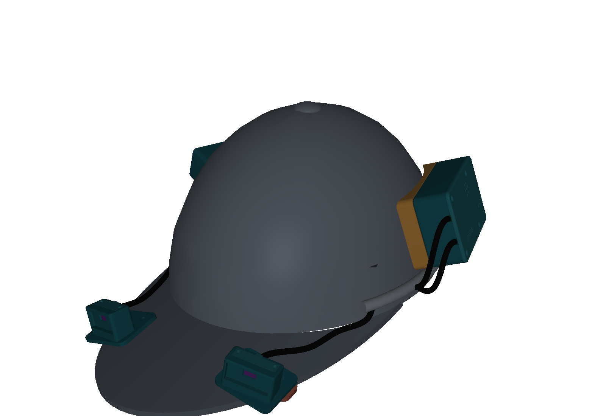

## Os tipos de arquivo desta pasta

| Pasta | Tipo | Para que serve |
|---|---|---|
| [`arquivos-stl/`](arquivos-stl/) | STL | A "malha" da peça, que o programa da impressora (o fatiador) lê. Já está na posição certa de imprimir |
| [`arquivos-step/`](arquivos-step/) | STEP | A peça com as medidas exatas, para abrir no FreeCAD ou no Fusion e medir ou conferir |
| [`bone-montado/`](bone-montado/) | GLB | O boné inteiro montado, para girar e ver no navegador (por exemplo em [3dviewer.net](https://3dviewer.net)) |
| [`pedido-de-impressao/`](pedido-de-impressao/) | PDF e 3MF | O pacote pronto para mandar a um serviço de impressão. O 3MF é um arquivo que junta várias peças numa mesa só |
| [`imagens/`](imagens/) | PNG | As imagens desta página, geradas automaticamente |
| [`codigo/`](codigo/) | Python | O código que desenha todas as peças |

## Onde cada peça fica no boné

```
                  aba (frente)
        S1 esq  ┌───────────────┐  S1 dir        suportes dos sensores, 5 mm atrás da borda da aba
                │               │
   case A  ▐████│    copa       │████▌  case B    laterais opostas, para equilibrar o peso
  (esquerda)    │               │   (direita)
                └──M1───────M1──┘                motores dentro da faixa interna, perto da nuca
                     nuca
```

| Conjunto | Lado | Como fica virado |
|---|---|---|
| Case A (eletrônica) | lateral esquerda | entradas dos cabos dos sensores para a frente, USB-C de carga para baixo, chave virada para a nuca |
| Case B (bateria) | lateral direita | tampa com o cabo virada para a nuca, furinhos de ventilação para fora da cabeça |
| Suportes dos sensores | aba, 50 mm para cada lado do centro | sensor olhando para a frente, 10 graus aberto para fora |
| Berços dos motores | faixa interna, perto da nuca | bolsinho do motor virado para a cabeça |

O case A foi desenhado para o lado esquerdo. Se ele for montado no direito, o USB-C fica virado para cima, e por isso a troca de lado precisa ser feita no código, não só girando a peça.

## As peças

| Arquivo | Quantidade | Material | Como imprimir |
|---|---|---|---|
| `A1_case_eletronica_corpo` | 1 | PETG | como está, sem suporte |
| `A2_case_eletronica_tampa` | 1 | PETG | já sai virada, com a face de fora na mesa |
| `A3_case_eletronica_base_curva` | 1 | PETG | face plana na mesa, 15% de preenchimento |
| `A4_case_eletronica_placa_interna` | 1 | PETG | plana. Ela se curva sozinha ao ser parafusada |
| `B1_case_bateria_corpo` | 1 | PETG | **em pé**, com a ponta fechada na mesa, sem suporte e com borda de adesão (brim) de 5 mm |
| `B2_case_bateria_tampa` | 1 | PETG | face de fora na mesa |
| `B3_case_bateria_placa_interna` | 1 | PETG | plana |
| `S1_suporte_sensor_esquerdo_XXgraus` | 1 de cada inclinação | PETG | base na mesa |
| `S1_suporte_sensor_direito_XXgraus` | 1 de cada inclinação | PETG | base na mesa |
| `S2_suporte_sensor_tampa` | 2 | PETG | plana |
| `S3_suporte_sensor_placa_sob_aba` | 2 | PETG | com os encaixes das porcas para cima |
| `M1_berco_motor` | 2 | **TPU 95A** | aba na mesa |

Escolhemos o **PETG** para o corpo das peças porque o PLA, o plástico mais comum, amolece no calor de um dia de sol, e o boné vai na cabeça, ao ar livre. O **TPU** é um plástico flexível, parecido com borracha: usamos só no berço do motor, que encosta na nuca.

**Configuração de impressão:** camada de 0,2 mm, **4 paredes** (é o que segura os parafusos e aguenta pancada), 25% de preenchimento em padrão giroide e nenhum suporte. Todas as peças foram desenhadas para imprimir sem suporte.

## Parafusos

Padronizamos **um único tamanho de parafuso, o M2** (2 mm de diâmetro), no projeto inteiro. Os furos têm 1,7 mm, e o parafuso abre a própria rosca no plástico.

| Onde | Parafuso | Quantidade |
|---|---|---|
| Tampa e placa do case A (o parafuso atravessa as duas) | M2 x 20, cabeça panela | 4 |
| Case A na base curva (por dentro do piso) | M2 x 6, cabeça chata | 4 |
| Placa interna A na base curva (por dentro do boné) | M2 x 8, cabeça chata | 4 |
| Tampa do case B | M2 x 12, cabeça panela | 4 |
| Placa interna B no corpo do case B | M2 x 8, cabeça chata | 4 |
| Suporte do sensor na aba | M2 x 8, cabeça panela, com porca M2 | 4 + 4 porcas |
| Tampinha do suporte do sensor | M2 x 6, cabeça panela | 4 |

A lista completa do que comprar, com fios e metragens, está em [`eletronica/lista-de-materiais.csv`](../eletronica/lista-de-materiais.csv).

## Montagem passo a passo

### Case A (eletrônica)

1. Fure o tecido do boné usando a placa interna como molde (4 furos de 2,5 mm) e passe cola de tecido em volta dos furos para não desfiar.
2. Coloque a placa interna por dentro e a base curva por fora. Aperte 4 parafusos M2 x 8 de cabeça chata, entrando por dentro do boné.
3. Cole a almofada de EVA de 3 mm na placa interna, do lado da cabeça, cobrindo as cabeças dos parafusos. Chanfre a borda da espuma com um estilete. A parte de baixo da placa entra por trás da faixa interna do boné.
4. Coloque o corpo do case sobre a base curva e aperte os 4 parafusos M2 x 6 por dentro do piso. Faça isso **antes** de colocar a eletrônica, porque dois desses parafusos ficam embaixo do carregador e da chave.
5. Deslize o carregador nos trilhos, com o USB-C encaixado no recorte da parede. Uma gota de cola quente trava o módulo.
6. Encaixe a chave no recorte da parede de trás, **com o lado "ligado" para cima**. O pontinho em relevo ao lado da chave marca esse lado, para a pessoa achar pelo tato.
7. Passe os cabos pelos entalhes das paredes. Dentro do case, aperte uma abraçadeira no cabo logo depois da parede: ela funciona como trava, e um puxão no cabo não chega na solda.
8. Apoie a placa ilhada nos quatro apoios do fundo e coloque a tampa por cima. Os 4 parafusos M2 x 20 atravessam as colunas da tampa e a placa e prendem as duas de uma vez.
9. Encaixe um pedaço de filamento transparente em cada um dos dois tubinhos da tampa, rente à face de fora. Eles levam a luz dos LEDs do carregador para fora do case.

**Como organizar a placa ilhada:** corte a placa em 5 x 4 cm. Deixe livre um círculo de 7 mm em volta de cada furo de canto, onde descem as colunas da tampa. Mantenha o bipe na posição de `BUZZER_POS` (é embaixo dos furos de som da tampa). Coloque os conectores dos sensores na borda da frente e os dos motores e da bateria na borda de trás. Fure os cantos da placa com 2,2 mm, a 2,5 mm de cada borda.

### Case B (bateria)

1. Solde o fusível rearmável no fio positivo e cubra com termo-retrátil.
2. Enrole a bateria em EVA de 1 mm, sem apertar, e coloque um calço de EVA em cada ponta.
3. Entre com o **polo positivo primeiro** (o "+" em baixo relevo na lateral mostra o lado). O fio do polo positivo volta por um canal na lateral do furo.
4. Acomode o fusível e a emenda dentro da tampa e passe o cabo pelo furo da ponta, com uma abraçadeira de trava por dentro.
5. Feche a tampa com 4 parafusos M2 x 12.
6. Prenda no boné pela placa interna (4 parafusos M2 x 8 por dentro) e cole a almofada de EVA, como no case A.

Os furinhos de ventilação ficam em cima do polo positivo, onde a bateria alivia pressão se um dia precisar. Eles apontam para fora da cabeça: não tampe com adesivo nem tecido.

### Suportes dos sensores

1. Solde os fios direto nos furos do sensor, **sem barra de pinos** (ela não cabe e faria alavanca). Cubra cada solda com termo-retrátil.
2. Desça o sensor por cima no encaixe, com o chip virado para a frente. Um pedaço de EVA de 1 mm atrás da plaquinha tira a folga e amortece batidas.
3. Passe o cabo pelo entalhe de trás. A lingueta da tampinha fecha o entalhe por cima.
4. Feche a tampinha com 2 parafusos M2 x 6.
5. Cole a base na aba, 5 mm atrás da borda, com fita dupla face de espuma. Fure a aba (2,5 mm), coloque a plaquinha de baixo com as porcas nos encaixes e aperte 2 parafusos M2 x 8.

**Como protegemos o sensor:** a face do chip fica 4 mm para dentro, atrás de uma moldura arredondada, e a própria aba avança 5 mm à frente do suporte. Uma batida de frente pega na aba e na moldura antes de chegar no sensor. A janela abre em funil, para não atrapalhar o campo de visão de 25 graus do sensor. **Não coloque acrílico nem vidro na janela:** o sensor perde alcance com qualquer cobertura.

**Qual inclinação usar:** a aba aponta para baixo quando o boné está na cabeça, e o ângulo muda de pessoa para pessoa. Imprima as três versões (0, 10 e 20 graus) e escolha no primeiro teste a que deixa o sensor olhando reto para a frente, usando um obstáculo na altura da testa.

### Berços dos motores e conforto

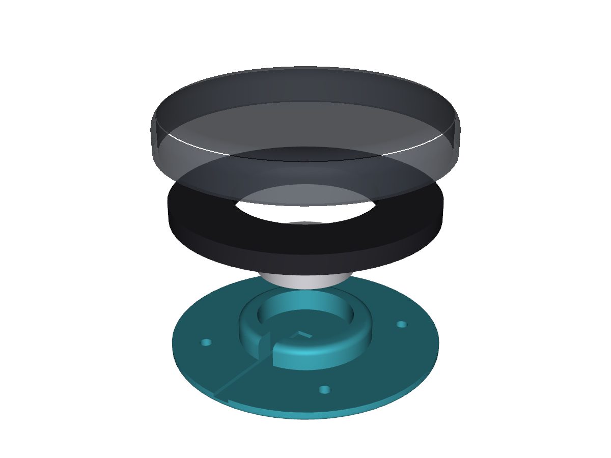

1. Encaixe o motor no berço de TPU. O encaixe é por pressão e o motor fica 0,3 mm para fora.
2. Corte um anel de EVA de 2 mm (27 mm por fora, 14,6 mm por dentro) e encaixe em volta do motor, sobre a aba do berço.
3. Costure um bolsinho de tecido macio na faixa interna, perto da nuca, e coloque o berço dentro, com o motor virado para a cabeça. Dá para tirar o berço e lavar o boné.

A regra que seguimos para o conforto é simples: **o plástico dá a estrutura e uma camada macia faz o contato com a pele.** Contamos o raciocínio na [decisão 005](../documentacao/decisoes/005-conforto-no-contato-com-a-cabeca.md).

## O que medir antes da impressão final

Os valores marcados com `[MEDIR]` em [`codigo/pecas/medidas.py`](codigo/pecas/medidas.py) são medidas típicas de mercado. Confira com o paquímetro nos componentes que vocês têm:

| Medida | Onde medir | O que dá errado se não conferir |
|---|---|---|
| `R_COPA` | curva da lateral do boné, perto da nuca (com um molde de papelão ou uma régua flexível) | a base curva balança no boné |
| `ABA_ESPESSURA` | espessura da aba | comprimento do parafuso do sensor |
| `GY_X`, `GY_Z`, `CHIP_OFF_Y`, `CHIP_OFF_Z` | plaquinha do sensor | janela desalinhada com o chip |
| `TP_X`, `TP_Y`, `TP_LEDS`, `USB_ALTURA_CENTRO` | carregador USB-C | USB fora do recorte ou tubinho de luz fora do LED |
| `CEL_D`, `CEL_L` | bateria 14500 com as lâminas de solda | folga da bateria no tubo |
| `MOTOR_D`, `MOTOR_H` | motor de vibração | aperto do motor no berço |

Nossa sugestão: imprimir primeiro o lote de teste de encaixe (está no [pedido de impressão](pedido-de-impressao/)), conferir tudo e só então imprimir o kit completo.

## O boné montado

A montagem junta todas as peças num boné de referência, desenhado em [`codigo/pecas/bone.py`](codigo/pecas/bone.py):

- copa de 200 x 160 x 105 mm (cerca de 57 cm de circunferência);
- aba curva de 75 mm, inclinada 12 graus para baixo;
- faixa interna (carneira) de 30 mm e abertura de regulagem na nuca;
- canaleta costurada por fora, que sai da frente esquerda, contorna a nuca passando por cima da regulagem e volta pela frente direita.

O código assenta cada peça sozinho: a base curva de cada case anda até encostar no tecido sem atravessar, e a placa interna faz o mesmo pelo lado de dentro. As posições ficam em `medidas.py`, no bloco `POS_*`.

**Caminho dos cabos:** cada sensor sai pela traseira do suporte, corre por cima da aba e entra na canaleta pela frente. Os dois cabos de sensor entram no case A pela parede da frente, e os cabos dos motores e da bateria saem pela parede de trás. O cabo da bateria sai da tampa do case B e contorna a nuca pela canaleta até o case A. Os fios dos motores saem da canaleta, atravessam o tecido e chegam aos berços.

O boné de referência é genérico. As peças só vão assentar como no modelo depois de medir o boné real e ajustar `R_COPA` e as medidas da copa (`BONE_A`, `BONE_B` e `BONE_C`). Na posição atual, o case A fica entre 26 e 31 mm saltado da copa. É a placa de circuito própria da V2 que vai diminuir essa altura.

| | |
|---|---|
| 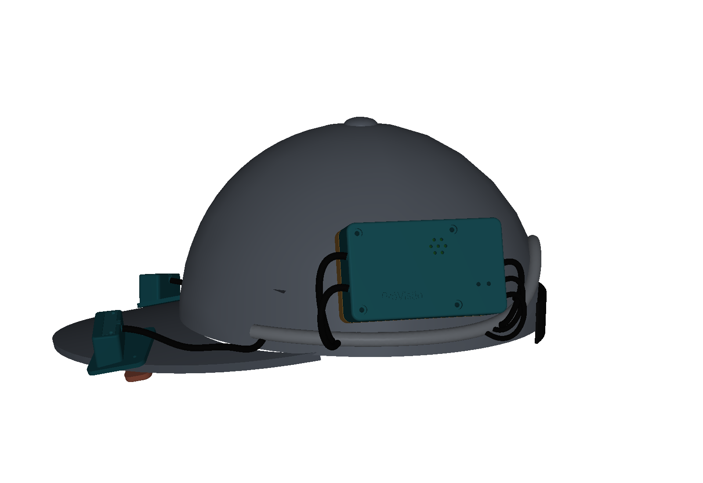 | 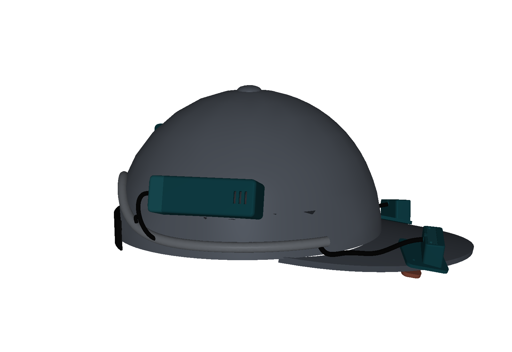 |
| Lateral esquerda: case A e a canaleta | Lateral direita: case B |
| 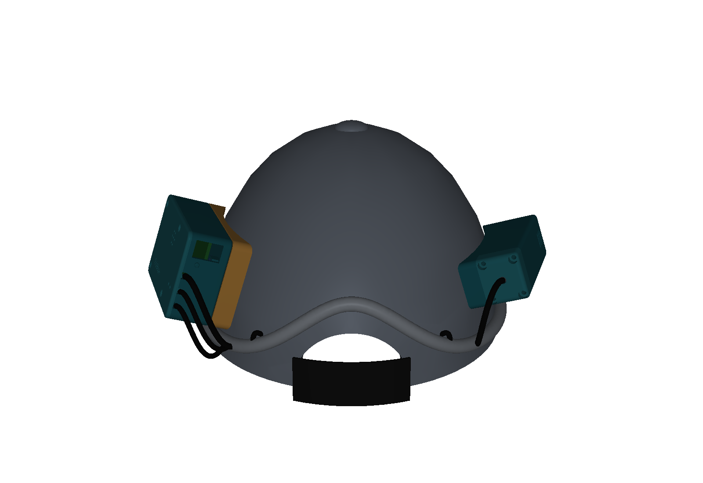 | 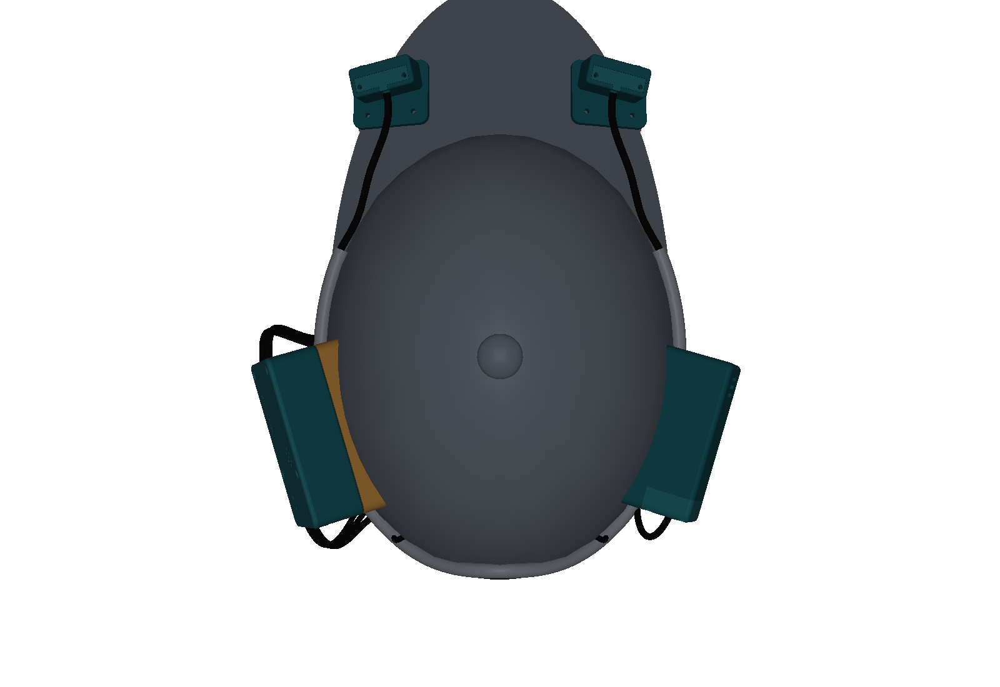 |
| Nuca: a canaleta passa por cima da regulagem | Vista de cima |
| 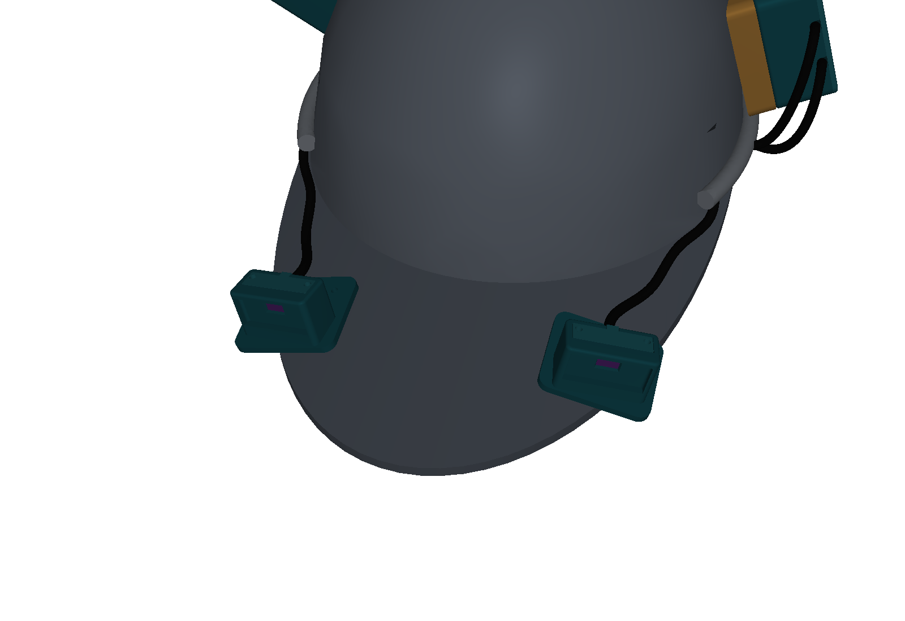 | 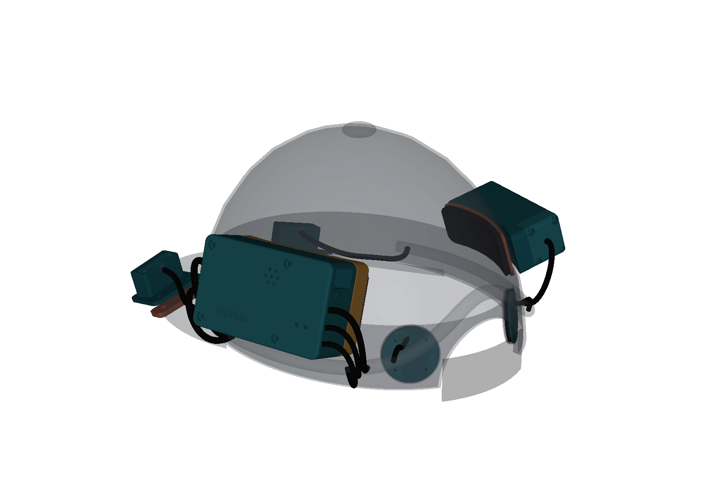 |
| Suportes dos sensores na aba | Vista transparente: placas internas, almofadas, berços e componentes |

## Como gerar tudo de novo

Você precisa do Python 3 e da biblioteca CadQuery (`pip install cadquery`). Depois:

```bash
cd modelagem-3d/codigo
python3 verificar_encaixes.py   # confere se alguma peça atravessa outra ou um componente
python3 gerar_pecas.py          # gera os arquivos STEP e STL
python3 gerar_imagens.py        # gera as imagens das peças
python3 montar_bone.py          # gera o boné montado (STEP, GLB e imagens)
python3 montar_bone.py --verificar   # confere se alguma peça atravessa o boné
python3 gerar_pedido_impressao.py    # refaz o pacote do pedido de impressão
```

O `verificar_encaixes.py` monta cada conjunto com versões simplificadas dos componentes (placa, carregador, USB-C, chave, bipe, bateria e sensor) e avisa se qualquer par se cruzar. O `gerar_pecas.py` também avisa se alguma malha sair aberta, porque serviços de impressão recusam esse tipo de arquivo.

## Como a pasta está organizada

```
modelagem-3d/
├── codigo/
│   ├── pecas/
│   │   ├── medidas.py            todas as medidas, num lugar só
│   │   ├── auxiliares.py         base curva, placa interna, furos e outras funções de apoio
│   │   ├── case_eletronica.py    case A
│   │   ├── case_bateria.py       case B
│   │   ├── suporte_sensor.py     suportes da aba
│   │   ├── berco_motor.py        berço, anel de EVA e bolsinho
│   │   ├── bone.py               o boné de referência
│   │   └── montagem.py           posições, assentamento e cabos do boné montado
│   ├── gerar_pecas.py  gerar_imagens.py  verificar_encaixes.py
│   └── montar_bone.py  gerar_pedido_impressao.py
├── arquivos-step/                peças e boné montado, com as medidas exatas
├── arquivos-stl/                 peças prontas para o fatiador
├── bone-montado/                 boné montado para ver no navegador
├── pedido-de-impressao/          pacote para o serviço de impressão
└── imagens/                      imagens geradas
```

## Imagens das peças

| | |
|---|---|
| 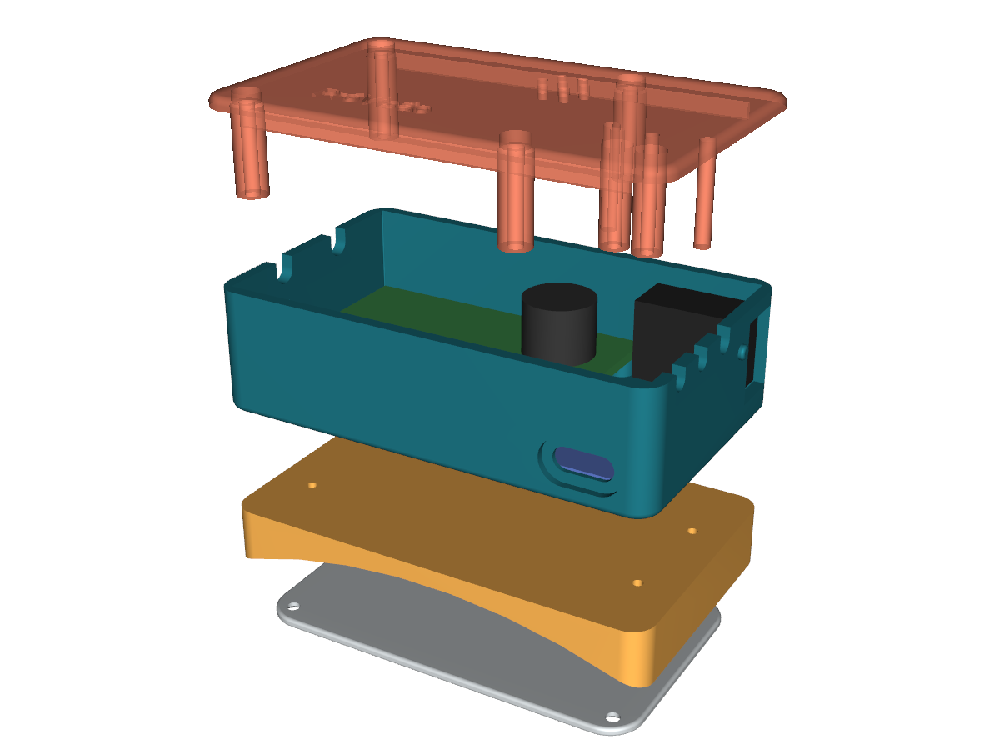 | 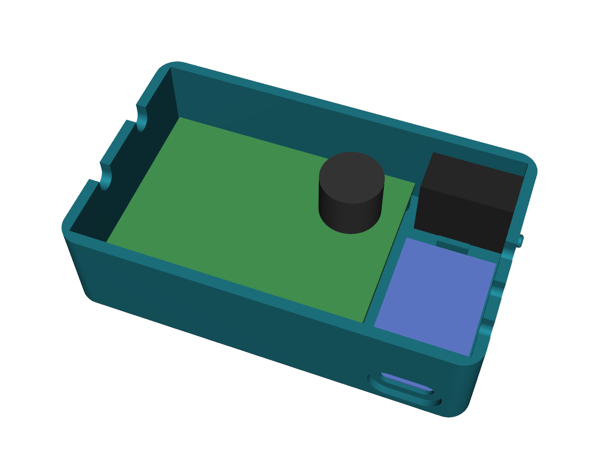 |
| Case A desmontado | Case A por dentro |
| 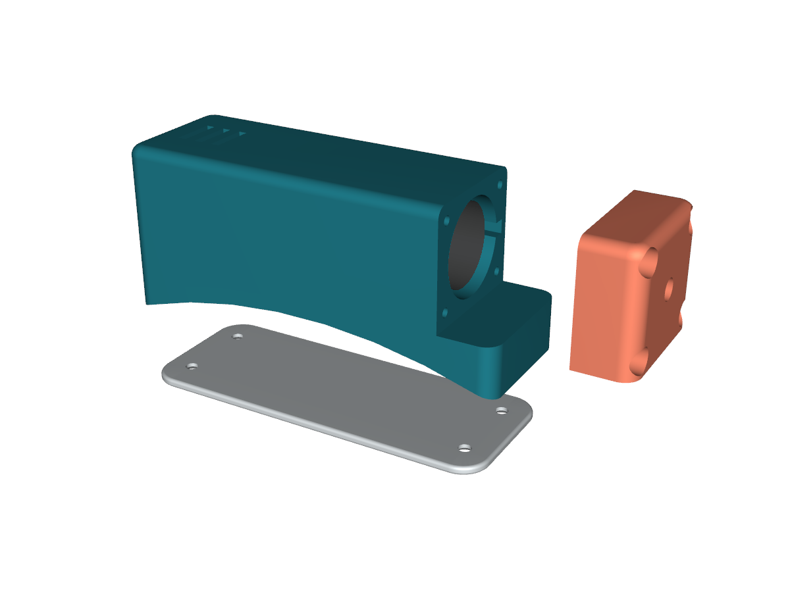 | 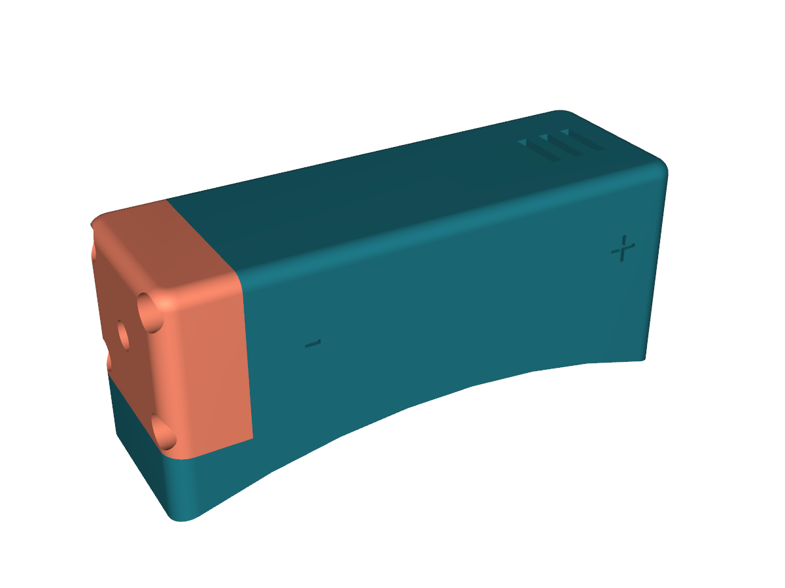 |
| Case B desmontado | Case B fechado |
| 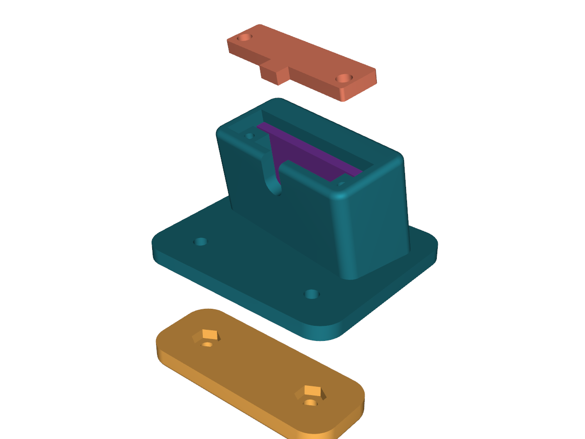 | 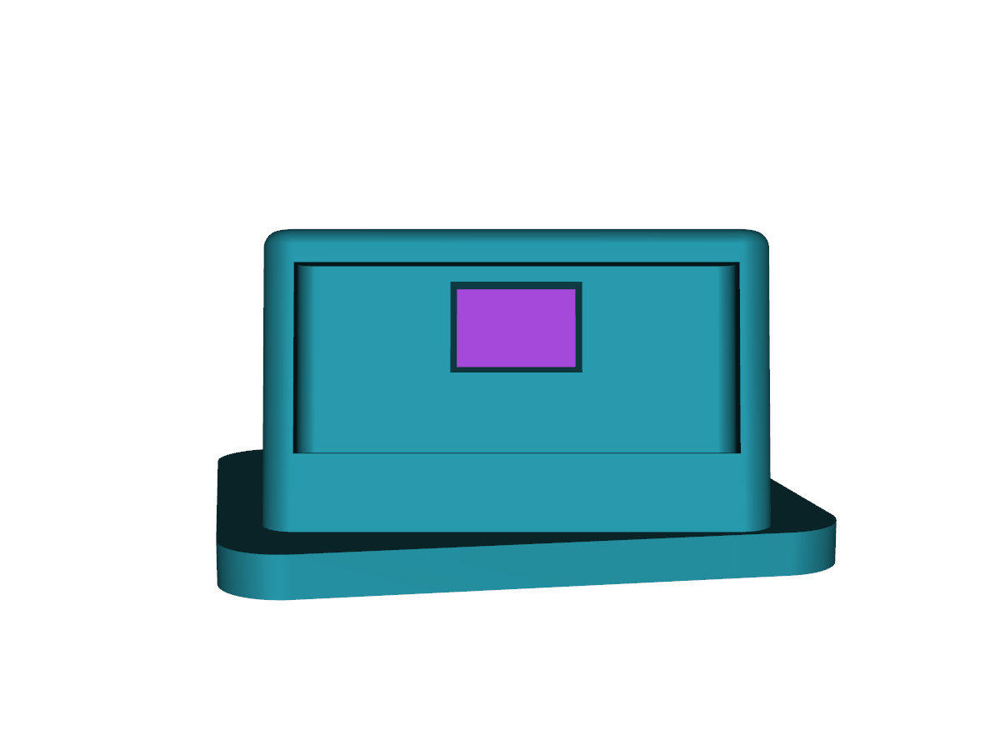 |
| Suporte do sensor desmontado | Suporte do sensor visto de frente |
| 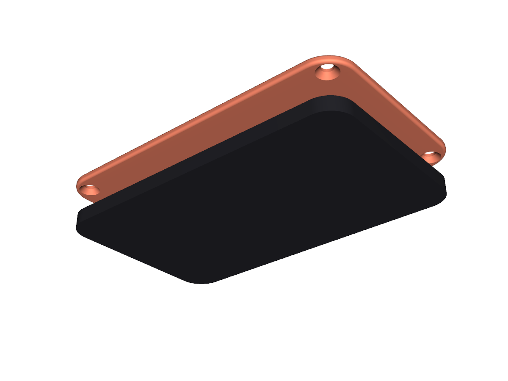 | 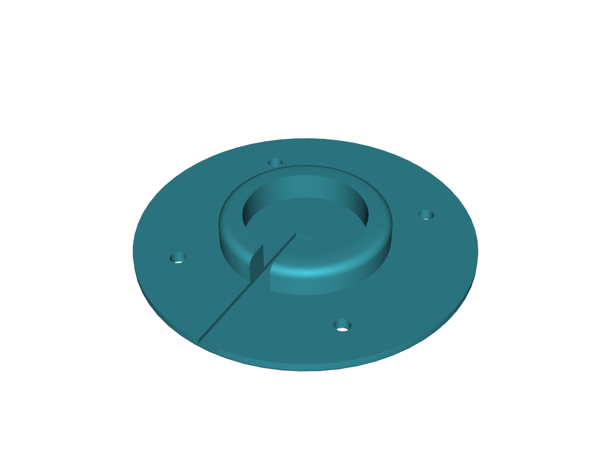 |
| Placa interna e almofada de EVA | Berço do motor em TPU |
